# medAI — Clinical Decision Support RAG System

**Clinical Domain:** USPSTF Depression and Suicide Risk in Adults (Grade B, June 2023 Guidelines)  
**System Architecture:** Multi-Stage Transparent Clinical Retrieval & Decision Support Engine

---

## 🏛️ System Architecture

```mermaid
flowchart TD
    subgraph Ingestion["Day 1: Document Ingestion Layer"]
        PDF["Raw Clinical PDFs\n(3 Guidelines / Syntheses)"] --> Parse["PDFplumber & PyMuPDF\n(729 sections, 1197 tables)"]
        Parse --> Clean["Text Cleaner & Normalizer\n(data/cleaned_output.json)"]
        Clean --> Chunk["Section-Aware Chunker\n([[PAGE:n]] sentinels -> 1,807 chunks)"]
        Chunk --> DenseIndex["ChromaDB Vector Database\n(all-MiniLM-L6-v2, 384-dim)"]
        Chunk --> SparseIndex["BM25Okapi Lexical Index\n(rank_bm25, medical regex)"]
    end

    subgraph Retrieval["Day 2: Multi-Stage Retrieval & Transparency Layer"]
        UserQuery["Clinical Query"] --> DenseRet["ChromaDB Dense Search\n(Top-15 Semantic Candidates)"]
        UserQuery --> SparseRet["BM25 Sparse Search\n(Top-15 Keyword Candidates)"]
        DenseRet & SparseRet --> RRF["Reciprocal Rank Fusion\n(RRF_K=60)"]
        RRF --> Pool["Candidate Pool (Top 15)"]
        Pool --> CrossEnc["Cross-Encoder Reranker\n(ms-marco-MiniLM-L-6-v2)"]
        CrossEnc --> SectionBoost["Section Prior Boost\n(Recommendation: 1.15x, General: 1.10x, etc.)"]
        SectionBoost --> Diversity["Greedy Top-3 Diversity Rule\n(Max 1 chunk per doc+section)"]
        Diversity --> FinalTop3["Final Top-3 Precision Passages\n(Calibrated Sigmoid Confidence)"]
        FinalTop3 --> AuditLog["Audit Logger\n(logs/retrieval.log)"]
    end
```



---

## 📊 Day 2 Retrieval Benchmark Scorecard

Evaluated over the **Expanded 16-Query Ground-Truth Benchmark Suite** (10 In-Scope, 3 Ambiguous, 3 Out-Of-Scope):

| Metric | Target Standard | Observed Baseline (v1) | Final Optimized Score | Status |
|---|---|---|---|---|
| **Mean Precision@3 (In-Scope)** | $\ge 80.0\%$ | 100.0% (6 queries) | **100.0% (13 queries)** | **PASS** |
| **Mean Reciprocal Rank (MRR)** | $\ge 0.7000$ | 1.0000 | **1.0000** | **PASS** |
| **Citation Existence Accuracy** | **100.0%** | N/A | **100.0%** | **PASS** |
| **Page Precision ($\text{Span} \le 10\text{p}$)** | $\ge 90.0\%$ | ~25.0% (broad spans) | **100.0% (exact page boundaries)** | **PASS** |
| **Mean Top-3 Confidence** | $\ge 70.0\%$ | 99.5% | **97.4%** | **PASS** |
| **OOS Confidence Separation** | Clear margin $> 0\%$ | N/A | **+23.3%** (In: 92.6% vs OOS: 69.3%) | **PASS** |
| **Calibrated Confidence Threshold** | $[0.50, 0.90]$ | 0.70 (default) | **0.81** (Empirical Midpoint) | **CALIBRATED** |

---

## 🚀 Key Modules & CLI Tools

- **`search_cli.py`**: Interactive CLI demonstrating candidate retrieval and reranking **before** LLM generation.
  ```bash
  python search_cli.py "Should pregnant women be screened for depression?"
  ```
- **`evaluate_retrieval.py`**: Evaluates the 16 clinical benchmark queries and generates rich terminal scorecards.
  ```bash
  python evaluate_retrieval.py
  ```
- **`src/evaluation/tuning_experiment.py`**: In-memory hyperparameter grid and model A/B testing suite.
  ```bash
  python src/evaluation/tuning_experiment.py
  ```
- **`ingest.py`**: Document ingestion pipeline converting raw PDFs into 1,807 vector-indexed passages.
  ```bash
  python ingest.py
  ```
- **`test_ingestion.py`**: Unit test suite for chunking and vector storage integrity.
  ```bash
  python test_ingestion.py
  ```

---

## 🔒 Regression Gate & Zero-Defect Guarantee

All Day 2 optimizations satisfy the strict regression gate:
1. **Zero Breaking Changes**: Mean Precision@3 remains **100.0%**, MRR remains **1.0000**.
2. **Exact Per-Page Citations**: Sentinels ensure References cite e.g. `p.181-181` instead of `p.95-708`.
3. **Screening Tools Consistency**: `has_screening_tools=True` $\iff$ non-empty `screening_tools` list across all 1,807 chunks.
4. **Transparent Audit Trail**: Every query logs candidate RRF scores, raw cross-encoder logits, section priors, and boosted confidence to `logs/retrieval.log`.
