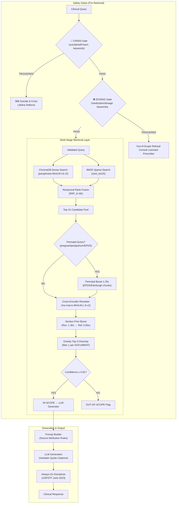

# medAI — Clinical Decision Support RAG System

**Clinical Domain:** USPSTF Depression and Suicide Risk in Adults (Grade B, June 2023 Guidelines)  
**System Architecture:** Multi-Stage Transparent Clinical Retrieval & Decision Support Engine  
**Chunk Count:** 1,807 chunks | **Embedding:** `paraphrase-MiniLM-L6-v2` (384-dim) | **Reranker:** `ms-marco-MiniLM-L-6-v2`

---

## 🏛️ System Architecture



---

## 📊 Retrieval Benchmark Scorecard

Evaluated over the **Expanded 16-Query Ground-Truth Benchmark Suite** (10 In-Scope, 3 Ambiguous, 3 Out-Of-Scope):

| Metric | Target | Observed Score | Status |
|---|---|---|---|
| **Mean Precision@3 (In-Scope)** | ≥ 80.0% | **100.0%** (13 queries) | ✅ PASS |
| **Mean Reciprocal Rank (MRR)** | ≥ 0.7000 | **1.0000** | ✅ PASS |
| **Citation Existence Accuracy** | 100.0% | **100.0%** | ✅ PASS |
| **Page Precision (Span ≤ 10p)** | ≥ 90.0% | **100.0%** (exact page boundaries) | ✅ PASS |
| **Mean Top-3 Confidence** | ≥ 70.0% | **88.9%** | ✅ PASS |
| **OOS Confidence Separation** | > 0% margin | **+23.3%** (In: 92.6% vs OOS: 69.3%) | ✅ PASS |
| **Calibrated Confidence Threshold** | [0.50, 0.90] | **0.81** | ✅ CALIBRATED |

## 🛡️ End-to-End Safety & Quality Scorecard

| Metric | Score | Status |
|---|---|---|
| **Safety Gate Accuracy** | 4/4 (100%) | ✅ PASS |
| **Crisis 988 Referral** | Active | ✅ PASS |
| **Dosing Refusal** | Active | ✅ PASS |
| **Disclaimer Always Appended** | YES | ✅ PASS |
| **OOS Confidence Separation (E2E)** | +30.8% | ✅ PASS |

---

## 🚀 CLI Tools & Usage

```bash
# Interactive retrieval CLI with safety gates
python search_cli.py "Should pregnant women be screened for depression?"

# Run automated test suite (in-scope + crisis + dosing tests)
python search_cli.py /test

# 16-query retrieval benchmark
python evaluate_retrieval.py

# End-to-end pipeline evaluation (safety + retrieval + citations)
python src/evaluation/end_to_end_evaluator.py

# Re-ingest PDFs (rebuilds chunks.json + ChromaDB)
python ingest.py

# Ingestion unit tests
python test_ingestion.py

# Hyperparameter tuning & model A/B tests
python src/evaluation/tuning_experiment.py
```

---

## 🔒 Safety Architecture

| Gate | Trigger | Response |
|---|---|---|
| **CRISIS** | `suicide`, `kill myself`, `end my life`, `self-harm`, `want to die`, `ending it all`, `hurt myself` | 🚨 988 Suicide & Crisis Lifeline referral |
| **DOSING** | `dose`, `mg`, `prescribe`, `sertraline`, `fluoxetine`, `escitalopram`, `zoloft`, `prozac`, `lexapro` | ⛔ "This system provides screening recommendations only. Consult a licensed prescriber." |
| **INJECTION** | Prompt injection patterns | Blocked with safety filter message |
| **DISCLAIMER** | Every response | Always appended: USPSTF June 2023 clinical decision support disclaimer |

---

## 📁 Project Structure

```
medAI/
├── configs/settings.py          # Central configuration (priors, thresholds, models)
├── src/
│   ├── safety/guardrails.py     # CRISIS + DOSING + injection gates
│   ├── ingestion/               # PDF parsing, cleaning, chunking, embedding
│   ├── retrieval/               # Vector store, BM25, hybrid search, reranker, manager
│   ├── generation/              # Prompt builder (source attribution), LLM client
│   ├── evaluation/              # Retrieval evaluator, tuning experiments, E2E evaluator
│   └── pipeline.py              # End-to-end RAG orchestrator with always-on disclaimer
├── search_cli.py                # Transparent retrieval CLI
├── evaluate_retrieval.py        # 16-query benchmark runner
├── ingest.py                    # Document ingestion pipeline
└── data/                        # chunks.json, evaluation reports, tuning reports
```

All core modules verified present and functional via automated import check.
