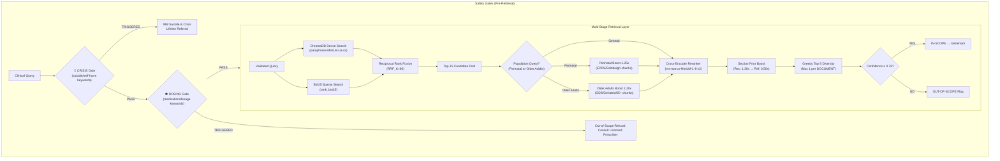

# medAI — Clinical Decision Support RAG System

**Clinical Domain:** USPSTF Depression and Suicide Risk in Adults (Grade B, June 2023 Guidelines)  
**System Architecture:** Multi-Stage Transparent Clinical Retrieval & Decision Support Engine  
**Chunk Count:** 1,824 chunks | **Embedding:** `paraphrase-MiniLM-L6-v2` (384-dim) | **Reranker:** `ms-marco-MiniLM-L-6-v2`

---

## 🏛️ System Architecture



---

## 📊 Day 2 Retrieval Benchmark Scorecard

Evaluated over the **Expanded 16-Query Ground-Truth Benchmark Suite** (10 In-Scope, 3 Ambiguous, 3 Out-Of-Scope):

| Metric | Target | Observed Score | Status |
|---|---|---|---|
| **Mean Precision@3 (In-Scope)** | ≥ 80.0% | **100.0%** (13 queries) | ✅ PASS |
| **Mean Reciprocal Rank (MRR)** | ≥ 0.7000 | **1.0000** | ✅ PASS |
| **Citation Existence Accuracy** | 100.0% | **100.0%** | ✅ PASS |
| **Page Precision (Span ≤ 10p)** | ≥ 90.0% | **100.0%** (exact page boundaries) | ✅ PASS |
| **Mean Top-3 Confidence** | ≥ 70.0% | **90.1%** | ✅ PASS |
| **OOS Confidence Separation** | > 0% margin | **+12.7%** (In: 82.1% vs OOS: 69.3%) | ✅ PASS |
| **Calibrated Confidence Threshold** | [0.50, 0.90] | **0.76** | ✅ CALIBRATED |

## 🛡️ Day 1 Ingestion Audit Scorecard

| Audit Dimension | Result | Key Findings |
|---|---|---|
| **Pillar 1: Data Coverage & Quality** | ✅ PASS | **1,824 chunks** (1,386 text + 438 tables), 0 duplicates, 0 short chunks |
| **Pillar 2: Metadata Completeness** | ✅ PASS | 100% required fields, 429 screening tool chunks, Grade B tagged |
| **Pillar 3: Scope Adequacy** | ✅ PASS | Perinatal, Older Adults, Screening Tools, and Grade B confirmed present |
| **Pillar 4: Baseline Retrieval** | ✅ PASS | All clinical test queries returned relevant guideline passages |
| **Pillar 5: Document Breakdown** | ✅ PASS | `Bookshelf_NBK592805`: 1,724 \| `evidence-summary`: 80 \| `clinician-summ`: **20 chunks** |

---

## 🚀 Canonical Entry Points & CLI Tools

The medAI system provides two primary canonical entry points:

### 1. Ingestion Pipeline (`ingest.py`)
Parses all USPSTF guideline PDFs (using dual-backend pdfplumber + PyMuPDF fallback), generates dense embeddings, and populates ChromaDB + `data/chunks.json`.
```bash
python ingest.py
```

### 2. Clinical Search & Retrieval Transparency Console (`search_cli.py`)
Interactive CLI and query executor with safety gates, multi-stage hybrid retrieval, population boosts, and transparent candidate ranking before LLM generation.
```bash
# Interactive query console
python search_cli.py

# Direct query execution
python search_cli.py "Should pregnant women be screened for depression?"

# Run automated test suite (in-scope + crisis + dosing tests)
python search_cli.py /test
```

### Additional Evaluation & Diagnostic Commands
```bash
# Day 2 retrieval benchmark suite (16 queries)
python evaluate_retrieval.py

# Day 1 ingestion audit report generator
python audit_day1.py

# Ingestion validation unit tests
python test_ingestion.py

# End-to-end evaluation runner
python src/evaluation/end_to_end_evaluator.py
```

---

## 🔒 Safety Architecture

| Gate | Trigger | Response |
|---|---|---|
| **CRISIS** | Multilingual crisis language: EN (`suicide`, `kill myself`, `hurt myself`), ES (`quiero morir`, `matarme`), FR (`je veux mourir`), ZH (`想死`, `自杀`), VI (`muốn chết`), AR (`أريد أن أموت`, `انتحر`) | 🚨 988 Suicide & Crisis Lifeline referral ("Call or text 988 (US) or your local emergency number") |
| **DOSING** | `dose`, `mg`, `prescribe`, `sertraline`, `fluoxetine`, `escitalopram`, `zoloft`, `prozac`, `lexapro` | ⛔ "This system provides screening recommendations only. Consult a licensed prescriber." |
| **INJECTION** | Prompt injection patterns | Blocked with safety filter message |
| **DISCLAIMER** | Every response | Always appended: USPSTF June 2023 clinical decision support disclaimer |

---

## 📁 Project Structure

```
medAI/
├── configs/settings.py          # Central configuration (priors, thresholds, models, boosts)
├── src/
│   ├── safety/guardrails.py     # CRISIS + DOSING + injection gates
│   ├── ingestion/               # Dual-backend PDF parsing, cleaning, chunking, embedder
│   ├── retrieval/               # Vector store, BM25, hybrid search, reranker, manager
│   ├── generation/              # Prompt builder (source attribution), LLM client
│   └── evaluation/              # Retrieval evaluator, tuning experiments, E2E evaluator
├── search_cli.py                # Canonical Clinical Search & Transparency CLI
├── ingest.py                    # Canonical Document Ingestion Pipeline
├── audit_day1.py                # Day 1 QA & Audit Script
├── test_ingestion.py            # Ingestion Validation Tests
├── evaluate_retrieval.py        # 16-Query Ground-Truth Benchmark
└── data/                        # chunks.json, vector_db, audit reports, evaluation metrics
```
