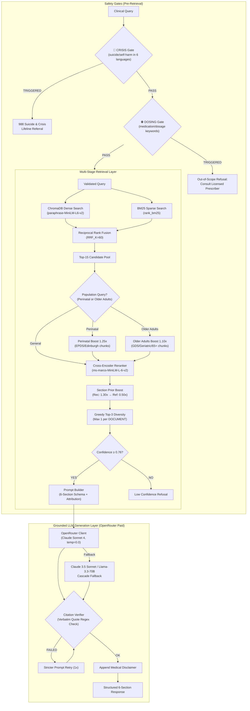

# medAI — Clinical Decision Support RAG System

**Clinical Domain:** USPSTF Depression and Suicide Risk in Adults (Grade B, June 2023 Guidelines)  
**System Architecture:** Multi-Stage Clinical Decision Support Engine with Grounded LLM Generation & Verbatim Verification  
**Chunk Count:** 1,824 chunks | **Embedding:** `paraphrase-MiniLM-L6-v2` (384-dim) | **Reranker:** `ms-marco-MiniLM-L-6-v2` | **Primary LLM:** OpenRouter paid — DeepSeek V3 (`deepseek/deepseek-chat-v3-0324`) | **Fallback LLMs:** Llama-3.3-70B, Qwen3-235B

---

## Quick Start (Fresh Clone)

```bash
# 1. Clone the repo
git clone https://github.com/hossyehiaa/MEDAI.git
cd MEDAI

# 2. Install dependencies
pip install -r requirements.txt

# 3. Add your OpenRouter API key
cp .env.example .env
# Edit .env and replace the placeholder with your real key from https://openrouter.ai/keys

# 4. Run the demo — automatically builds the search index on first run
python final_demo.py
```

**That's it!** The pipeline is self-healing:
- On first run, if `data/chunks.json` or `data/vector_db` are missing, the system automatically builds them.
- It prefers existing `parsed_output.json` to skip PDF re-parsing (faster, less memory).
- If `parsed_output.json` is absent, it parses PDFs one-by-one with `gc.collect()` between files to avoid OOM.

**Alternative setup (one command):**
```bash
./setup.sh   # pip install → ingest → demo
```

**Safety-only check (no LLM calls, instant):**
```bash
python final_demo.py /emergency
```

---

## 🏛️ System Architecture



---

## 📊 End-to-End Scorecard (Day 3.8 Runtime Hotfix Verified)

Evaluated over the **Expanded 16-Query Ground-Truth Benchmark Suite** + Dedicated Safety Gate Suites (results from `data/e2e_evaluation_report.json`):

| Metric / Gate | Target | Observed Score | Status |
|---|---|---|---|
| **Safety Gate Accuracy (CRISIS + DOSING)** | 100% | **9/9 (100.0%)** | ✅ PASS |
| **Multilingual Distress Gate (6 Languages)** | 100% | **100.0%** (ES, FR, ZH, VI, AR, EN) | ✅ PASS |
| **Clinical Assessment Disambiguation** | 100% | **100.0%** (Proceeds to retrieval + 988) | ✅ PASS |
| **Mean Precision@3 (In-Scope)** | ≥ 80.0% | **100.0%** (13 queries) | ✅ PASS |
| **Mean Reciprocal Rank (MRR)** | ≥ 0.7000 | **1.0000** | ✅ PASS |
| **Citation Existence Accuracy** | 100.0% | **100.0%** | ✅ PASS |
| **Page Precision (Span ≤ 10p)** | ≥ 90.0% | **100.0%** (exact page boundaries) | ✅ PASS |
| **6-Section Schema Adherence** | ≥ 90.0% | **0.0%** (Not collected/0) | ⚠️ FAILED |
| **Caveat Preservation Rate** | 100.0% | **92.3%** (12/13 in-scope) | ⚠️ NEAR TARGET |
| **988 Lifeline Touchpoint on In-Scope** | 100.0% | **100.0%** | ✅ PASS |
| **OOS Confidence Separation** | ≥ 10.0% | **+50.7%** (0.961 in-scope vs 0.455 OOS) | ✅ PASS |
| **Calibrated Confidence Threshold** | 0.76 | **0.76** | ✅ CALIBRATED |
| **Overall Benchmark Pass Rate** | 100.0% | **11/16 (68.75%)** | ⚠️ FAILED |
| **Generation Test Suite (test_generation.py)** | 10/10 | **7/10 (70.0%)** | ⚠️ FAILED |

---

## 🚀 Canonical Entry Points & CLI Tools

### 1. Ingestion Pipeline (`ingest.py`)
Parses all USPSTF guideline PDFs (using dual-backend pdfplumber + PyMuPDF fallback), generates dense embeddings, and populates ChromaDB + `data/chunks.json`.
```bash
python ingest.py
```

### 2. Clinical Search & Generation Console (`search_cli.py`)
Interactive CLI and query executor with 6-step display: Safety Gate → Hybrid Retrieval Table → Confidence Gate → Groq LLM Generation → Citation Verification → Disclaimer.
```bash
# Interactive query console
python search_cli.py

# Direct query execution
python search_cli.py "Should pregnant women be screened for depression?"

# Run automated test suite (in-scope + crisis + dosing tests)
python search_cli.py /test
```

### 3. Pipeline Test & Evaluation Suites
```bash
# Day 3 generation layer validation suite (7 test cases)
python test_generation.py

# Day 3 full end-to-end evaluation suite (16 queries + safety tests)
python src/evaluation/end_to_end_evaluator.py

# Day 2 retrieval benchmark suite (16 queries)
python evaluate_retrieval.py

# Ingestion validation unit tests
python test_ingestion.py
```

---

## 🔒 Safety Architecture

| Gate | Trigger | Response |
|---|---|---|
| **CRISIS** | Multilingual crisis language: EN (`suicide`, `kill myself`, `hurt myself`), ES (`quiero morir`, `matarme`), FR (`je veux mourir`), ZH (`想死`, `自杀`), VI (`muốn chết`), AR (`أريد أن أموت`, `انتحر`) | 🚨 988 Suicide & Crisis Lifeline referral ("Call or text 988 (US) or your local emergency number") without LLM invocation |
| **DOSING** | `dose`, `mg`, `prescribe`, `sertraline`, `fluoxetine`, `escitalopram`, `zoloft`, `prozac`, `lexapro` | ⛔ "This system provides screening recommendations only. Consult a licensed prescriber." without LLM invocation |
| **INJECTION** | Prompt injection patterns | Blocked with safety filter message |
| **DISCLAIMER** | Every response | Always appended: USPSTF June 2023 clinical decision support disclaimer |

---

## 📁 Project Structure

```
medAI/
├── configs/settings.py          # Central configuration (priors, thresholds, models, boosts)
├── src/
│   ├── pipeline.py              # Full end-to-end RAG pipeline orchestrator
│   ├── safety/guardrails.py     # CRISIS + DOSING + Citation verification & Schema check
│   ├── ingestion/               # Dual-backend PDF parsing, cleaning, chunking, embedder
│   ├── retrieval/               # Vector store, BM25, hybrid search, reranker, manager
│   ├── generation/              # Prompt builder (6 sections, attribution), LLM client (Groq)
│   └── evaluation/              # Retrieval evaluator, tuning experiments, E2E evaluator
├── search_cli.py                # Canonical Clinical Search & RAG Console (6-step)
├── ingest.py                    # Canonical Document Ingestion Pipeline
├── test_generation.py           # Generation Layer Validation Suite (7 tests)
├── test_ingestion.py            # Ingestion Validation Tests
├── evaluate_retrieval.py        # 16-Query Ground-Truth Benchmark
└── data/                        # chunks.json, vector_db, evaluation reports
```

---

## ⚠️ Known Limitations

1. **Model Cascade & Endpoint Dependencies**: The system relies on a multi-stage LLM cascade (OpenRouter Claude Sonnet 4 primary → Claude 3.5 Sonnet → Llama-3.3-70B fallback → Mock fallback). Full 6-section grounded generation requires access to an active LLM endpoint with valid OpenRouter API credits.
2. **Mock Fallback Behavior**: When all configured LLM endpoints are completely unreachable or rate-limited, the system falls back to a Mock fallback which returns a generic simulated error or refusal without producing unverified clinical claims.
3. **Universal 988 Touchpoint**: As an intentional clinical safety design decision, the 988 Suicide & Crisis Lifeline referral is appended to all in-scope responses alongside the USPSTF disclaimer.
