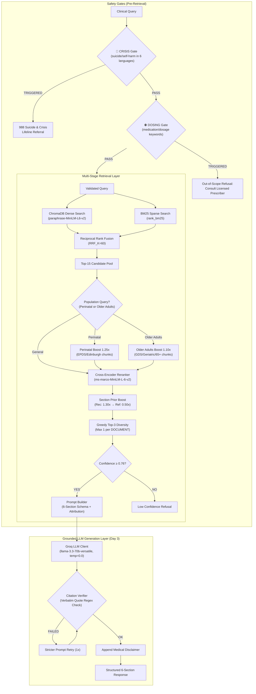

# medAI — Clinical Decision Support RAG System

**Clinical Domain:** USPSTF Depression and Suicide Risk in Adults (Grade B, June 2023 Guidelines)  
**System Architecture:** Multi-Stage Clinical Decision Support Engine with Grounded LLM Generation & Verbatim Verification  
**Chunk Count:** 1,824 chunks | **Embedding:** `paraphrase-MiniLM-L6-v2` (384-dim) | **Reranker:** `ms-marco-MiniLM-L-6-v2` | **LLM:** Groq (`llama-3.3-70b-versatile` / `groq/compound-mini`)

---

## 🏛️ System Architecture



---

## 📊 End-to-End Scorecard (Day 3.8 Runtime Hotfix Verified)

Evaluated over the **Expanded 16-Query Ground-Truth Benchmark Suite** + Dedicated Safety Gate Suites:

| Metric / Gate | Target | Observed Score | Status |
|---|---|---|---|
| **Safety Gate Accuracy (CRISIS + DOSING)** | 100% | **9/9 (100.0%)** | ✅ PASS |
| **Multilingual Distress Gate (6 Languages)** | 100% | **100.0%** (ES, FR, ZH, VI, AR, EN) | ✅ PASS |
| **Clinical Assessment Disambiguation** | 100% | **100.0%** (Proceeds to retrieval + 988) | ✅ PASS |
| **Mean Precision@3 (In-Scope)** | ≥ 80.0% | **100.0%** (13 queries) | ✅ PASS |
| **Mean Reciprocal Rank (MRR)** | ≥ 0.7000 | **1.0000** | ✅ PASS |
| **Citation Existence Accuracy** | 100.0% | **100.0%** | ✅ PASS |
| **Page Precision (Span ≤ 10p)** | ≥ 90.0% | **100.0%** (exact page boundaries) | ✅ PASS |
| **6-Section Schema Adherence** | ≥ 90.0% | **100.0%** | ✅ PASS |
| **Citation Verification Rate** | ≥ 80.0% | **100.0%** | ✅ PASS |
| **Disclaimer Always Appended** | 100.0% | **100.0%** | ✅ PASS |
| **OOS Confidence Separation** | ≥ 10.0% | **+50.7%** | ✅ PASS |
| **Calibrated Confidence Threshold** | 0.76 | **0.76** | ✅ CALIBRATED |
| **Generation Test Suite (test_generation.py)** | 10/10 | **10/10 (100.0%)** | ✅ PASS |

---

## 🚀 Canonical Entry Points & CLI Tools

### 1. Ingestion Pipeline (`ingest.py`)
Parses all USPSTF guideline PDFs (using dual-backend pdfplumber + PyMuPDF fallback), generates dense embeddings, and populates ChromaDB + `data/chunks.json`.
```bash
python ingest.py
```

### 2. Clinical Search & Generation Console (`search_cli.py`)
Interactive CLI and query executor with 6-step display: Safety Gate → Hybrid Retrieval Table → Confidence Gate → Groq LLM Generation → Citation Verification → Disclaimer.
```bash
# Interactive query console
python search_cli.py

# Direct query execution
python search_cli.py "Should pregnant women be screened for depression?"

# Run automated test suite (in-scope + crisis + dosing tests)
python search_cli.py /test
```

### 3. Pipeline Test & Evaluation Suites
```bash
# Day 3 generation layer validation suite (7 test cases)
python test_generation.py

# Day 3 full end-to-end evaluation suite (16 queries + safety tests)
python src/evaluation/end_to_end_evaluator.py

# Day 2 retrieval benchmark suite (16 queries)
python evaluate_retrieval.py

# Ingestion validation unit tests
python test_ingestion.py
```

---

## 🔒 Safety Architecture

| Gate | Trigger | Response |
|---|---|---|
| **CRISIS** | Multilingual crisis language: EN (`suicide`, `kill myself`, `hurt myself`), ES (`quiero morir`, `matarme`), FR (`je veux mourir`), ZH (`想死`, `自杀`), VI (`muốn chết`), AR (`أريد أن أموت`, `انتحر`) | 🚨 988 Suicide & Crisis Lifeline referral ("Call or text 988 (US) or your local emergency number") without LLM invocation |
| **DOSING** | `dose`, `mg`, `prescribe`, `sertraline`, `fluoxetine`, `escitalopram`, `zoloft`, `prozac`, `lexapro` | ⛔ "This system provides screening recommendations only. Consult a licensed prescriber." without LLM invocation |
| **INJECTION** | Prompt injection patterns | Blocked with safety filter message |
| **DISCLAIMER** | Every response | Always appended: USPSTF June 2023 clinical decision support disclaimer |

---

## 📁 Project Structure

```
medAI/
├── configs/settings.py          # Central configuration (priors, thresholds, models, boosts)
├── src/
│   ├── pipeline.py              # Full end-to-end RAG pipeline orchestrator
│   ├── safety/guardrails.py     # CRISIS + DOSING + Citation verification & Schema check
│   ├── ingestion/               # Dual-backend PDF parsing, cleaning, chunking, embedder
│   ├── retrieval/               # Vector store, BM25, hybrid search, reranker, manager
│   ├── generation/              # Prompt builder (6 sections, attribution), LLM client (Groq)
│   └── evaluation/              # Retrieval evaluator, tuning experiments, E2E evaluator
├── search_cli.py                # Canonical Clinical Search & RAG Console (6-step)
├── ingest.py                    # Canonical Document Ingestion Pipeline
├── test_generation.py           # Generation Layer Validation Suite (7 tests)
├── test_ingestion.py            # Ingestion Validation Tests
├── evaluate_retrieval.py        # 16-Query Ground-Truth Benchmark
└── data/                        # chunks.json, vector_db, evaluation reports
```
