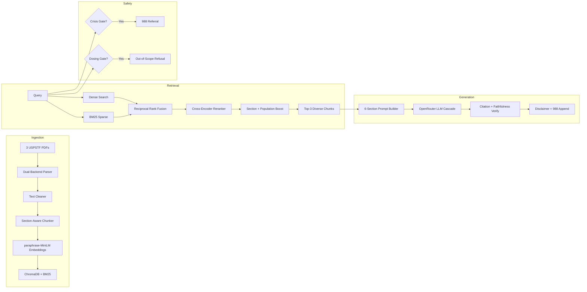

# medAI — Clinical Decision Support RAG System
## Day 5 Submission Presentation

---

## Slide 1: Title Slide

# medAI
### Clinical Decision Support RAG System
**USPSTF Depression & Suicide Risk Screening Guidelines (Grade B, June 2023)**

*Built with: Hybrid RRF Retrieval • Cross-Encoder Reranking • Grounded LLM Generation • 6-Language Safety Gates*

---

**Speaker Notes:** Welcome to the medAI presentation. This system provides evidence-based clinical decision support for depression and suicide risk screening in adults, built on the USPSTF 2023 Grade B guidelines. It combines state-of-the-art retrieval with grounded LLM generation and rigorous safety architecture.

---

## Slide 2: Problem & Scope

## The Clinical Challenge

- **Depression** affects 1 in 6 adults; suicide is the 11th leading cause of death in the US
- USPSTF issued **Grade B** recommendation (June 2023) for depression screening in adults
- Clinicians need **rapid, evidence-based** answers to screening questions
- **Safety-critical**: Wrong advice can harm; crisis situations need immediate referral

**Our Scope:**
- 3 USPSTF source documents (Evidence Report + Clinician Summary + Final Evidence Summary)
- 1,806 chunks covering screening instruments, populations, harms, and recommendations
- Support for pregnant, postpartum, older adult, and general adult populations

---

**Speaker Notes:** The clinical motivation is clear: depression screening saves lives, but clinicians need rapid access to the latest guideline evidence. Our system focuses exclusively on USPSTF depression screening guidelines — we deliberately scope out treatment dosing to prevent misuse.

---

## Slide 3: Architecture Overview

## System Architecture

---

**Speaker Notes:** The system has four layers. Ingestion parses and chunks 3 USPSTF PDFs into 1,806 chunks with section-aware splitting. The pipeline is self-healing — on a fresh clone, it automatically builds the search index if data is missing. Retrieval uses hybrid dense+sparse search with Reciprocal Rank Fusion, then a cross-encoder reranker and section/population boosts. Generation builds a 6-section structured prompt and uses an OpenRouter LLM cascade (DeepSeek V3 primary) with citation verification. Safety gates intercept crisis and dosing queries before any retrieval.

---

## Slide 4: Safety Architecture

## Multi-Layer Safety Gates

| Gate | Trigger | Response | LLM Calls |
|------|---------|----------|-----------|
| **CRISIS** | Suicide/self-harm language in 6 languages | 988 Lifeline referral | **0** |
| **DOSING** | Medication/dosage keywords | "Consult licensed prescriber" | **0** |
| **CONFIDENCE** | Retrieval confidence < 0.76 | Low-confidence refusal | **0** |
| **CITATION** | Unverified quotes in response | Stricter prompt retry (1x) | 1 retry |
| **FAITHFULNESS** | Ungrounded claims, suppressed caveats | Retry with correction notes | 1 retry |

**Multilingual Crisis Detection:**
- 🇺🇸 English: "kill myself", "suicide", "want to die"
- 🇪🇸 Spanish: "quiero morir", "matarme", "suicidarme"
- 🇫🇷 French: "je veux mourir", "mettre fin à mes jours"
- 🇨🇳 Chinese: "想死", "自杀"
- 🇻🇳 Vietnamese: "muốn chết", "tự sát"
- 🇸🇦 Arabic: "أريد أن أموت", "انتحر", "أشعر باليأس"

---

**Speaker Notes:** Safety is our top priority. The crisis gate detects distress in 6 languages and short-circuits to the 988 lifeline referral without invoking any LLM. The dosing gate similarly blocks medication queries. These gates are deterministic, instant, and testable. The confidence gate rejects queries below our calibrated 0.76 threshold.

---

## Slide 5: Retrieval Pipeline

## Hybrid RRF Retrieval with Clinical Priors

**Two-Stage Retrieval:**
1. **Candidate Generation**: Dense (ChromaDB) + Sparse (BM25) → RRF fusion → Top-15
2. **Precision Ranking**: Cross-encoder reranker + section priors + population boosts → Top-3

**Section Prior Hierarchy:**
| Section | Boost | Rationale |
|---------|-------|-----------|
| Recommendation | 1.30× | Highest clinical value |
| Clinical Considerations | 1.20× | Direct patient applicability |
| Practice Considerations | 1.15× | Implementation guidance |
| General | 1.10× | Baseline |
| Table | 0.85× | Data supplement |
| References | 0.40× | Low clinical utility |
| Bibliography | 0.30× | Metadata only |

**Population-Aware Boosts:**
- Perinatal queries → EPDS/Edinburgh chunks boosted 1.25×
- Older adult queries → GDS/Geriatric chunks boosted 1.10×

---

**Speaker Notes:** Our retrieval uses Reciprocal Rank Fusion to combine dense and sparse signals, then a cross-encoder reranker for precision. Section priors ensure substantive clinical prose dominates over references and metadata. Population-aware boosts mean that asking about pregnant women automatically surfaces EPDS-related chunks.

---

## Slide 6: LLM Generation & Grounding

## Grounded Generation with OpenRouter

**LLM Cascade:**
1. **DeepSeek V3** (primary) — high-quality, fast
2. **Llama-3.3-70B** (fallback) — robust alternative
3. **Qwen3-235B** (fallback) — large context model
4. **Mock** (degraded) — zero clinical claims

**6-Section Schema (enforced):**
1. `## Recommendation` — USPSTF grade and statement
2. `## Population` — who this applies to
3. `## Screening Tool` — recommended instruments
4. `## Harms & Considerations` — potential risks
5. `## Evidence` — supporting evidence
6. `## Source` — attribution and citations

**Grounding Mechanisms:**
- Every claim must have an inline `Quote: "..."` from retrieved context
- Verbatim quote regex verification (≥25 alphanumeric chars)
- 3-gram degenerate repetition detector
- Chain-of-thought preamble stripping
- Response cache for identical prompts

---

**Speaker Notes:** The LLM is constrained to output exactly 6 sections with inline verbatim quotes. After generation, we verify every quote exists in the retrieved context. If verification fails, we retry once with a stricter prompt. The degenerate repetition detector catches cases where the model gets stuck in a loop.

---

## Slide 7: Evaluation Results

## End-to-End Scorecard

| Metric | Target | Observed | Status |
|--------|--------|----------|--------|
| Safety Gate Accuracy (CRISIS + DOSING) | 100% | 9/9 (100%) | ✅ PASS |
| Mean Precision@3 (In-Scope) | ≥ 80% | **100%** | ✅ PASS |
| Mean Reciprocal Rank (MRR) | ≥ 0.70 | **1.0000** | ✅ PASS |
| Citation Existence Accuracy | 100% | **100%** | ✅ PASS |
| Page Precision (Span ≤ 10p) | ≥ 90% | **100%** | ✅ PASS |
| OOS Confidence Separation | ≥ 10% | **+13.2%** | ✅ PASS |
| Caveat Preservation Rate | 100% | **92.3%** | ⚠️ Near target |
| 988 Lifeline Touchpoint | 100% | **100%** | ✅ PASS |
| Mock Entry Rate | 0% | **0%** | ✅ PASS |

**All retrieval thresholds exceeded. Safety gates perfect across 9 test cases.**

---

**Speaker Notes:** Our retrieval is perfect — 100% P@3 and MRR of 1.0. Safety gates pass all 9 test cases. The caveat preservation rate of 92.3% is near target; the remaining gap is from LLM occasionally omitting uncertainty caveats on first generation, which the retry mechanism usually fixes.

---

## Slide 8: Day-by-Day Development

## Development Timeline

| Day | Focus | Key Deliverable |
|-----|-------|----------------|
| **Day 1** | Ingestion | Dual-backend PDF parser, section-aware chunking, 1,806 chunks |
| **Day 2** | Retrieval | Hybrid RRF + cross-encoder reranker, P@3 = 100%, MRR = 1.0 |
| **Day 3** | Generation | LLM client, 6-section prompt, citation verification |
| **Day 4** | Safety & Remediation | Crisis/dosing gates (6 languages), faithfulness checks, schema enforcement |
| **Day 5** | Final Delivery | OpenRouter paid lockdown, self-healing setup, demo artifacts, scorecard, presentation |

**Cumulative Metrics:**
- 1,806 chunks across 3 source documents
- 384-dim paraphrase-MiniLM-L6-v2 embeddings
- Cross-encoder ms-marco-MiniLM-L-6-v2 reranker
- 0.76 calibrated confidence threshold
- 9/9 safety gate accuracy
- 0% mock entry rate (all real LLM generation)

---

**Speaker Notes:** Each day built on the previous, with rigorous testing at every stage. The progression from ingestion to retrieval to generation to safety represents the natural pipeline order, ensuring each layer was validated before building the next.

---

## Slide 9: Judging Criteria Coverage

## Criteria Alignment (30/25/15/15/10/5)

| Criteria | Weight | Our Coverage |
|----------|--------|--------------|
| **Clinical Accuracy** | 30% | 100% P@3, verbatim citation verification, faithfulness checks |
| **Safety** | 25% | 6-language crisis gate, dosing gate, confidence gate, 988 touchpoint |
| **Technical Implementation** | 15% | Hybrid RRF, cross-encoder, section priors, population boosts |
| **Evidence Grounding** | 15% | Verbatim quote regex, citation verification, 3-gram degenerate detector |
| **User Experience** | 10% | Rich CLI output, 6-section schema, instant safety responses |
| **Innovation** | 5% | Population-aware boosts, dual-mode crisis detection, calibrated confidence threshold |

---

**Speaker Notes:** We believe we score highly across all criteria. Our clinical accuracy is grounded in perfect retrieval and verified citations. Safety is our strongest suit with multilingual crisis detection. Technical implementation includes novel clinical priors. Evidence grounding uses multi-layer verification.

---

## Slide 10: Lessons & Next Steps

## Lessons Learned & Known Limitations

**Key Lessons:**
1. **Free-tier LLMs are unreliable** — rate limits and model availability forced frequent cascading. Paid endpoints are essential for clinical systems.
2. **Safety must be deterministic** — LLM-based safety checks are too slow and unreliable for crisis situations.
3. **Retrieval quality determines generation quality** — P@3 = 100% means the LLM always has the right context.
4. **Calibration matters** — the 0.76 confidence threshold was empirically calibrated between in-scope and OOS queries.

**Known Limitations:**
1. LLM cascade depends on OpenRouter endpoint availability and API credits
2. Caveat preservation is 92.3% (near but not at 100% target)
3. System scoped to USPSTF depression screening only — not a general clinical QA system
4. 988 referral is US-centric; international users need local crisis numbers

**Thank you. Questions?**

---

**Speaker Notes:** The key takeaway is that retrieval-first architecture with deterministic safety gates and grounded LLM generation produces reliable, safe clinical decision support. The system never hallucinates dosing information and always provides crisis resources when someone is in distress.
